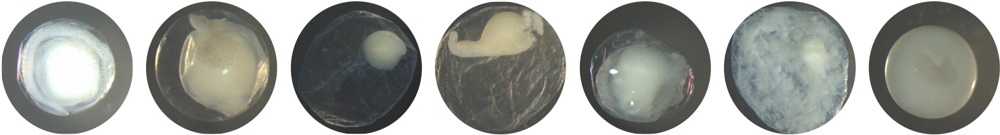

# WhoseEgg

Repository to store the code associated with the WhoseEgg R Shiny app for classifying invasive carp eggs using a random forest model. The app is available at https://whoseegg.stat.iastate.edu/.

## Completed

- Fix flagged variable
- Add warning if the data is in the future

## To do

- If you try to upload a non-csv file after uploading a file, you get a weird error on the prediction page
- Organize helper functions
- Organize github for future developers
- Create video showing how to use the app
- Add video to home page of app
- Add image during loading of swimming fish

## Repository Structure

## Updating the App

## Ideas for Future Versions

Data Input: 

- Add option for manual input of one observation (could try using a Google form embedding in the app)
- Look into research on data input in apps

Methods:

- Add more visualizations:
  - Comparing input data to training data
  - Create an MDS plot with training and new data
  - Make plots interactive
  - Add plots comparing predictions with egg characteristics
- Interpretations of random forest probabilities
  - Add a nice interpretation
  - Add comments on the interpretations of probabilities near 0.5-0.6
  - Look into how to compute empirical probabilities and try out the model calibration technique
  - Read papers on model calibration:
    - [https://onlinelibrary.wiley.com/doi/abs/10.1002/sam.11446](https://onlinelibrary.wiley.com/doi/abs/10.1002/sam.11446)
    - [https://pubmed.ncbi.nlm.nih.gov/29290291/](https://pubmed.ncbi.nlm.nih.gov/29290291/)
    - [https://www.sciencedirect.com/science/article/pii/S1532046415000027](https://www.sciencedirect.com/science/article/pii/S1532046415000027)
- Add random forest prediction intervals
- Switch to using random forests with reduced features
- Try using weighting in random forests to account for imbalance in classes

Format: 

- Figure out a better way to fix the header so it doesn't cover material when the screen size changes
- Fix the WhoseEgg color text when hovered over
- Add a download image button

Other:

- Add a check for when a new dataset is uploaded
- Add formal tests
- Connect with GitHub actions
- Look into the process the fish bioenergetics Shiny app uses to update frequently with more data and fish species
- Update functions and code to make more efficient