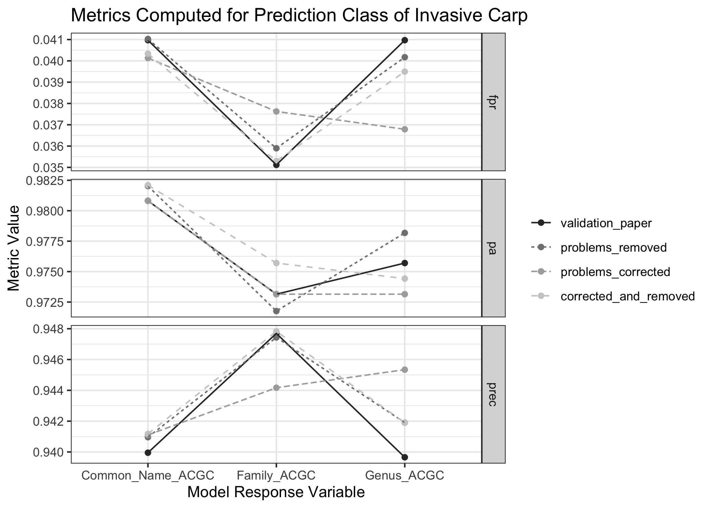

Preparing Egg Data for WhoseEgg Shiny App
================
Katherine Goode <br>
Last Updated: May 05, 2021

This notebook contains the code for preparing the egg data for the
WhoseEgg app.

Load R packages:

``` r
library(dplyr)
library(forcats)
library(ggplot2)
library(purrr)
library(randomForest)
library(stringr)
library(tidyr)
library(tools)
```

# Identify the Problematic Eggs

We discovered that the manner in which the larval lengths were measured
given the egg stage appear to differ between 2014-2015 and 2016. This
sections looks more into this and saves a file with all of the possibly
problematic eggs.

Load the raw 2014-2016 data from the validation paper:

``` r
eggdata_raw <-
  read.csv(
    "https://raw.githubusercontent.com/goodekat/carp-egg-rf-validation/master/data/eggdata141516_raw.csv"
  )
```

Clean the data to match what was done to the data for the validation
paper (expect for removing extra variables):

``` r
eggdata_cleaned_all_var <- 
  eggdata_raw %>%
  rename_all(
    .funs = function(.) {
      str_replace_all(., "[.]", " ") %>% 
        tolower() %>% 
        toTitleCase() %>% 
        str_replace_all(" ", "_") %>% 
        str_replace("Sd", "SD") %>% 
        str_replace("Cv", "CV") %>% 
        str_replace("Acgc", "ACGC") %>%
        str_replace("Temp", "Temperature")
    }
  ) %>%
  # Rename variables using yolk to embryo
  rename(
      "Embryo_to_Membrane_Ratio" = "Yolk_to_Membrane_Ratio",
      "Embryo_Ave" = "Yolk_Ave",
      "Embryo_SD" = "Yolk_SD",
      "Embryo_CV" = "Yolk_CV",
  ) %>%
  # Only keep observations with identified genetics
  filter(Questionable_Genetics == "NO") %>%
  # Remove any observations with missing values
  na.omit() %>%
  # Fix some mistakes in site and river levels
  mutate(Site = as.character(Site), River = as.character(River)) %>%
  mutate(Site = ifelse(Site == "DMW", "DNW", Site),
         Site = ifelse(Site == "kqa", "KQA", Site),
         River = ifelse(River == "UNR", "UMR", River),
         River = ifelse(River == "UPR", "UMR", River),
         River = ifelse(River == "DMS", "DSM", River)) %>%
  mutate(Site = factor(Site), River = factor(River)) 
```

Print the dimensions of the cleaned data:

``` r
dim(eggdata_cleaned_all_var)
```

    ## [1] 1979   46

Create a table showing the proportion of observations with a larval
length of 0 for each egg stage and year – note that in 2014 and 2015,
all eggs that were not in egg stage 7 or 8 have a larval length of 0,
and all eggs in egg stage of 7 or 8 have a larval of 0 – this is not the
case in 2016:

``` r
eggdata_cleaned_all_var %>%
  group_by(Egg_Stage, Year) %>%
  summarise(
    n_zeros = sum(Larval_Length == 0),
    freq = n(), 
    .groups = "drop"
  ) %>%
  mutate(prop_of_zeros = round(n_zeros / freq, 4)) %>%
  select(-n_zeros, -freq) %>%
  pivot_wider(id_cols = Egg_Stage, names_from = Year, values_from = prop_of_zeros) %>%
  knitr::kable()
```

| Egg\_Stage | 2014 | 2015 |   2016 |
|:-----------|-----:|-----:|-------:|
| 1          |    1 |    1 | 1.0000 |
| 2          |    1 |    1 | 0.9000 |
| 3          |    1 |    1 | 0.9744 |
| 4          |    1 |    1 | 1.0000 |
| 5          |    1 |    1 | 0.9836 |
| 6          |    1 |    1 | 0.7975 |
| 7          |    0 |    0 | 0.1346 |
| 8          |    0 |    0 | 0.0345 |
| BROKEN     |    1 |   NA |     NA |
| D          |    1 |    1 | 0.9796 |

Identify the eggs from 2016 with non-zero larval lengths with an egg
stage other than 7 or 8:

``` r
eggs_wrong_non_zero_lls <-
  eggdata_cleaned_all_var %>%
  filter(Year == 2016, Egg_Stage %in% c(1:6, "D", "BROKEN"), Larval_Length > 0)
```

Identify the eggs from 2016 with larval lengths of zero with an egg
stage of 7 or 8:

``` r
eggs_wrong_zero_lls  <-
  eggdata_cleaned_all_var %>%
  filter(Year == 2016, Egg_Stage %in% c(7,8), Larval_Length == 0)
```

Join the possibly problematic eggs:

``` r
eggs16_problems <-
  bind_rows(eggs_wrong_non_zero_lls, eggs_wrong_zero_lls)
```

Print the dimensions of the possibly problematic eggs:

``` r
dim(eggs16_problems)
```

    ## [1] 29 46

Save the possibly problematic eggs:

``` r
write.csv(eggs16_problems, "../data/problematic-eggs.csv", row.names = FALSE)
```

# Comments from Mike About Problematic Eggs

-   Egg stages from the problematic eggs all look okay

-   For the eggs in stages other than 7 and 8, we could change the
    larval lengths to 0 to match Carlos’s approach

-   For the eggs in stages 7-8, he can’t get the larval lengths

-   Should we take all of these eggs out?

-   Should we remove only the eggs in stages 7 and 8 with non-zero
    larval lengths

-   Try fitting models and see how it affects the results from the
    various options

-   Mike’s email with updated eggs: “A lot of the rest I looked at I
    changed to stage 7, so the length was valid. I put a few comments in
    the column at the end.” Updated data is in the file “2016 eggs with
    incorrect data\_MW.csv”

# Comparing Models

Here I create four different datasets and fit a model for each to
compare how handling the problematic eggs affects the results. The four
datasets/models I consider are the full dataset from the validation
paper with problematic eggs:

-   unchanged
-   removed
-   corrected by Mike
-   corrected by Mike but eggs in stage 7 and 8 with larval lengths of 0
    removed

## Preparation

Make a list of the response variables:

``` r
vars_resp = c(
  "Family_ACGC",
  "Genus_ACGC",
  "Common_Name_ACGC"
)
```

Make a vector of the predictor variables:

``` r
vars_pred = c(
  "Month",
  "Julian_Day",
  "Temperature",
  "Conductivity",
  "Larval_Length",
  "Membrane_Ave",
  "Membrane_SD",
  "Membrane_CV",
  "Embryo_to_Membrane_Ratio",
  "Embryo_Ave",
  "Embryo_SD",
  "Embryo_CV",
  "Egg_Stage",
  "Compact_Diffuse",
  "Pigment",
  "Sticky_Debris",
  "Deflated"
)
```

Function for preparing the data to match the form from the validation
paper:

``` r
clean_eggdata <- function(data) {
  data %>%
    # Convert necessary variables to factors
    mutate_at(
      .vars = c(
        "Egg_Stage",
        "Compact_Diffuse",
        "Pigment",
        "Sticky_Debris",
        "Deflated",
        all_of(vars_resp)
      ),
      .funs = factor
    ) %>%
    # Make sure the Invasive Carp level is still the first factor level (like ACGC was)
    # Otherwise, the random forest results will change slightly
    mutate(
      Family_ACGC = fct_relevel(Family_ACGC, "Invasive Carp"),
      Genus_ACGC = fct_relevel(Genus_ACGC, "Invasive Carp"),
      Common_Name_ACGC = fct_relevel(Common_Name_ACGC, "Invasive Carp")
    )
}
```

## Reconstruct Data from Validation Paper

Load the data from the validation paper and prepare as necessary for
analysis:

``` r
eggdata_val_paper <-
  # Access the data from the validation paper that will be used for WhoseEgg
  # The difference from the data accessed earlier is the lack of some extra
  # variables that are not needed for the validation paper or WhoseEgg
  read.csv(
    paste0(
      "https://raw.githubusercontent.com/goodekat/",
      "carp-egg-rf-validation/master/data/eggdata141516.csv"
    )
  ) %>%
  # Change the level of ACGC to Invasive Carp for easier terminology in the app
  mutate(
    Family_ACGC = fct_recode(Family_ACGC, "Invasive Carp" = "ACGC"),
    Genus_ACGC = fct_recode(Genus_ACGC, "Invasive Carp" = "ACGC"),
    Common_Name_ACGC = fct_recode(Common_Name_ACGC, "Invasive Carp" = "ACGC")
  ) %>%
  # Finish cleaning steps
  clean_eggdata() %>% 
  # Remove unnecessary variable
  select(-Dataset)
```

## Create Data with All Problem Observation Removed

Identify the eggs from 2016 with non-zero larval lengths with an egg
stage other than 7 or 8 and the eggs from 2016 with larval lengths of
zero with an egg stage of 7 or 8:

``` r
eggdata_flagged <- 
  eggdata_val_paper %>%
  mutate(Flagged = ifelse(
    Year == 2016 & Egg_Stage %in% c(1:6, "D", "BROKEN") & Larval_Length > 0,
    TRUE,
    ifelse(Year == 2016 & Egg_Stage %in% c(7, 8) & Larval_Length == 0,
           TRUE,
           FALSE)
  )) %>%
  select(Flagged, everything())
```

Determine the number of problematic (flagged) eggs:

``` r
eggdata_flagged %>% count(Flagged)
```

    ##   Flagged    n
    ## 1   FALSE 1949
    ## 2    TRUE   29

Remove the problem observations:

``` r
eggdata_problems_removed <- eggdata_flagged %>% filter(Flagged == FALSE)
```

Check that the correct number of observations have been removed:

``` r
n_removed_eggs = (dim(eggdata_val_paper)[1] - dim(eggdata_problems_removed)[1])
n_problem_eggs = table(eggdata_flagged$Flagged)[[2]]
n_removed_eggs == n_problem_eggs
```

    ## [1] TRUE

## Create Data with Egg Stages Corrected by Mike

Load the data with the problematic eggs with egg stage and larval length
corrected by Mike where possible and clean as needed:

``` r
eggs_corrected_MW <- 
  read.csv("../data/2016 eggs with incorrect data_MW.csv") %>%
  # Convert variables to numeric as needed
  mutate(Conductivity = as.numeric(Conductivity)) %>%
  # Change the level of ACGC to Invasive Carp for easier terminology in the app
  mutate(
    Family_ACGC = fct_recode(Family_ACGC, "Invasive Carp" = "ACGC"),
    Genus_ACGC = fct_recode(Genus_ACGC, "Invasive Carp" = "ACGC"),
    Common_Name_ACGC = fct_recode(Common_Name_ACGC, "Invasive Carp" = "ACGC")
  ) %>%
  # Finish cleaning steps
  clean_eggdata()
```

Identify the variable names to keep for the analysis based on those in
the validation paper data:

``` r
var_names = names(eggdata_val_paper)
```

Select the problematic eggs from the validation data and the correct
data and check that all observations are the same (except for egg stage
and larval length):

``` r
# Get the validation paper data problematic eggs
problem_eggs_old <-
  eggdata_flagged %>% 
  filter(Flagged == TRUE) %>% 
  select(-Flagged,-Egg_Stage,-Larval_Length) %>%
  mutate(
    Family_ACGC = factor(Family_ACGC),
    Genus_ACGC = factor(Genus_ACGC),
    Common_Name_ACGC = factor(Common_Name_ACGC)
  )

# Get the corrected versions of the problematic eggs
problem_eggs_corrected <- 
  eggs_corrected_MW %>% 
  select(all_of(var_names)) %>% 
  select(-Egg_Stage, -Larval_Length)

# Check that the other variables are the same
all_equal(problem_eggs_old, problem_eggs_corrected)
```

    ## [1] TRUE

Join the good eggs from the validation paper data with the corrected
versions of the problem eggs and clean data as necessary:

``` r
eggdata_corrected <- 
  eggdata_problems_removed %>%
  bind_rows(eggs_corrected_MW %>% select(all_of(var_names))) %>%
  clean_eggdata() %>%
  select(-Flagged)
```

Perform some checks to make sure the data dimensions are correct:

``` r
# Check that there are no eggs with egg stage not in 7 or 8 with a larval length above 0
dim(eggdata_corrected %>% filter(!(Egg_Stage %in% c(7,8)), Larval_Length > 0))[1] == 0
```

    ## [1] TRUE

``` r
# Check that the number of observations is correct
dim(eggdata_corrected)[1] == dim(eggdata_val_paper)[1]
```

    ## [1] TRUE

## Create Data with Egg Stages Corrected by Mike and Larval Lengths Set to 0

There are still some eggs in the data in stages 7 and 8 with a larval
length of 0. Mike was not able to fix the larval length for these eggs:

``` r
dim(eggdata_corrected %>% filter(Egg_Stage %in% c(7,8), Larval_Length == 0))[1]
```

    ## [1] 6

Remove the eggs in stages 7 and 8 with larval lengths of 0 and clean
data as necessary:

``` r
eggdata_corrected_removed <- 
  eggdata_corrected %>%
  filter(!(Egg_Stage %in% c(7,8)) | Larval_Length != 0) %>%
  clean_eggdata()
```

## Fit All Random Forests

Function for fitting a random forest model given a response variable,
predictor variables, and a dataset (uses the same seed to fit the random
forests as Camacho et al. (2019) and Goode et al. (2021)):

``` r
fit_rf <- function(resp, preds, data) {
  
  # Fit the random forest
  set.seed(808)
  rf <- randomForest(
    data %>% pull(resp) ~ .,
    data = data %>% select(all_of(preds)),
    importance = T,
    ntree = 1000
  )
  
  # Put model in a named list
  rf_list = list(rf)
  names(rf_list) = resp
  
  # Return the named list
  return(rf_list)
  
}
```

Fit the random forest models:

``` r
rfs_val_data <-
  map(
    .x = vars_resp,
    .f = fit_rf,
    preds = vars_pred,
    data = eggdata_val_paper
  ) %>%
  flatten()

rfs_prob_remv <-
  map(
    .x = vars_resp,
    .f = fit_rf,
    preds = vars_pred,
    data = eggdata_problems_removed
  ) %>%
  flatten()

rfs_prob_corr <-
  map(
    .x = vars_resp,
    .f = fit_rf,
    preds = vars_pred,
    data = eggdata_corrected
  ) %>%
  flatten()

rfs_prob_corr_remv <-
  map(
    .x = vars_resp,
    .f = fit_rf,
    preds = vars_pred,
    data = eggdata_corrected_removed
  ) %>%
  flatten()
```

Check to make sure the random forests trained on the unchanged data from
the validation paper agree (note that these random forests are available
on
[GitHub](https://github.com/goodekat/carp-egg-rf-validation/blob/master/results/rfs141516.rds))

``` r
rfs141516 <- readRDS("../../../validation/results/rfs141516.rds")
c(
  identical(rfs141516$Family_ACGC$forest, rfs_val_data$Family_ACGC$forest),
  identical(rfs141516$Genus_ACGC$forest, rfs_val_data$Genus_ACGC$forest),
  identical(rfs141516$Common_Name_ACGC$forest, rfs_val_data$Common_Name_ACGC$forest)
)
```

    ## [1] TRUE TRUE TRUE

## Compute Random Forest Metrics

Functions for computing metrics from the validation paper:

``` r
# Function for computing predictive accuracy
compute_pa <- function(category, obs, pred) {
  data.frame(obs, pred) %>%
    filter(obs == category) %>%
    summarise(pa = sum(obs == pred) / n()) %>%
    as.numeric()
}
# Function for computing false positive accuracy
compute_fpr <- function(category, obs, pred) {
  data.frame(obs, pred) %>%
    filter(obs != category) %>%
    summarise(sum(pred == category) / n()) %>%
    as.numeric()
}
# Function for computing non-target taxa accuracy
compute_prec <- function(category, obs, pred) {
 data.frame(obs, pred) %>%
    filter(pred == category) %>%
    summarise(sum(obs == pred) / n()) %>%
    as.numeric()
}
```

Function for applying the metrics to the models in this notebook using
out-of-bag (OOB) predictions:

``` r
# Function for computing validation metrics
compute_metrics <- function(scenario, model, model_name, data) {
  
  # Extract the response variable from the validation data
  obs = data %>% pull(model_name)
  
  # Apply the random forest model to the validation data
  # to obtain predictions
  pred = predict(object = model)
  
  # Compute the metrics for validation for each class and put them
  # in a data frame
  class = "Invasive Carp"
  data.frame(
    scenario = scenario,
    model = model_name,
    class = class,
    pa = compute_pa(class, obs = obs, pred = pred),
    fpr = compute_fpr(class, obs = obs, pred = pred),
    prec = compute_prec(class, obs = obs, pred = pred)
  ) %>%
    mutate_at(.vars = c("model", "class"), .funs = as.character)
  
}
```

Compute the OOB metrics from all models on their respective training
data:

``` r
metrics_oob <-
  bind_rows(
    map2_df(
      .x = rfs_val_data,
      .y = names(rfs_val_data),
      .f = compute_metrics,
      data = eggdata_val_paper,
      scenario = "validation_paper"
    ),
    
    map2_df(
      .x = rfs_prob_remv,
      .y = names(rfs_prob_remv),
      .f = compute_metrics,
      data = eggdata_problems_removed,
      scenario = "problems_removed"
    ),
    
    map2_df(
      .x = rfs_prob_corr,
      .y = names(rfs_prob_corr),
      .f = compute_metrics,
      data = eggdata_corrected,
      scenario = "problems_corrected"
    ),
    
    map2_df(
      .x = rfs_prob_corr_remv,
      .y = names(rfs_prob_corr_remv),
      .f = compute_metrics,
      data = eggdata_corrected_removed,
      scenario = "corrected_and_removed"
    )
  )

metrics_oob
```

    ##                 scenario            model         class        pa        fpr
    ## 1       validation_paper      Family_ACGC Invasive Carp 0.9731458 0.03511706
    ## 2       validation_paper       Genus_ACGC Invasive Carp 0.9757033 0.04096990
    ## 3       validation_paper Common_Name_ACGC Invasive Carp 0.9808184 0.04096990
    ## 4       problems_removed      Family_ACGC Invasive Carp 0.9717587 0.03589744
    ## 5       problems_removed       Genus_ACGC Invasive Carp 0.9781772 0.04017094
    ## 6       problems_removed Common_Name_ACGC Invasive Carp 0.9820282 0.04102564
    ## 7     problems_corrected      Family_ACGC Invasive Carp 0.9731458 0.03762542
    ## 8     problems_corrected       Genus_ACGC Invasive Carp 0.9731458 0.03678930
    ## 9     problems_corrected Common_Name_ACGC Invasive Carp 0.9808184 0.04013378
    ## 10 corrected_and_removed      Family_ACGC Invasive Carp 0.9757033 0.03529412
    ## 11 corrected_and_removed       Genus_ACGC Invasive Carp 0.9744246 0.03949580
    ## 12 corrected_and_removed Common_Name_ACGC Invasive Carp 0.9820972 0.04033613
    ##         prec
    ## 1  0.9476961
    ## 2  0.9396552
    ## 3  0.9399510
    ## 4  0.9474343
    ## 5  0.9419036
    ## 6  0.9409594
    ## 7  0.9441687
    ## 8  0.9453416
    ## 9  0.9411043
    ## 10 0.9478261
    ## 11 0.9419036
    ## 12 0.9411765

Plot the metrics:

``` r
metrics_oob %>%
  pivot_longer(cols = c(pa, fpr, prec), names_to = "metric") %>%
  mutate(
    scenario = fct_relevel(
      scenario,
      "validation_paper",
      "problems_removed",
      "problems_corrected",
      "corrected_and_removed"
    )
  ) %>%
  ggplot(aes(
    x = model,
    y = value,
    group = scenario,
    linetype = scenario,
    color = scenario
  )) +
  geom_point() +
  geom_line() +
  facet_grid(metric ~ ., scales = "free_y") +
  scale_color_grey() +
  theme_bw() + 
  labs(
    x = "Model Response Variable",
    y = "Metric Value",
    color = "",
    linetype = "",
    title = "Metrics Computed for Prediction Class of Invasive Carp"
  )
```

<!-- -->

# Save the Egg Data for WhoseEgg
