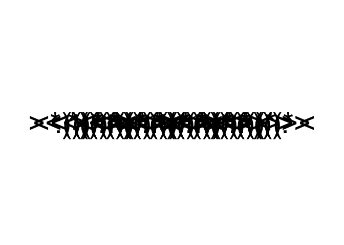

Creating a Swimming Fish Animation for WhoseEgg Shiny App
================
Katherine Goode <br>
Last Updated: May 10, 2021

This notebook contains the code for creating a swimming fish animation
to use in the app.

Load packages:

``` r
library(dplyr)
library(ggplot2)
library(gganimate)
```

Create the data for the animation:

``` r
nlocations <- 10
swimming_fish_df <-
  data.frame(
    x = c(
      seq(1, 0, length.out = nlocations),
      seq(0, 1, length.out = nlocations)
    ),
    y = rep(0, nlocations * 2),
    label = c(
      rep(c("<*)))><", "<*)))>:"), nlocations / 2),
      rep(c("><(((*>", ":<(((*>"), nlocations / 2)
    )
  ) %>%
  mutate(id = 1:n())
```

Create a static version of the animation:

``` r
swimming_fish_plot <-
  swimming_fish_df %>%
  ggplot(aes(x = x, y = y, label = label)) +
  geom_text(size = 15) +
  theme_void() +
  xlim(-0.3, 1.3)
swimming_fish_plot
```

<!-- -->

Animate the swimming fish:

``` r
swimming_fish <- 
  swimming_fish_plot + 
  transition_states(states = id, state_length = 0, wrap = F)
animate(plot = swimming_fish, nframes = 40)
```

<!-- -->

Save the animation:

``` r
anim_save(
  filename = "../www/swimming_fish.gif",
  animation = animate(plot = swimming_fish, nframes = 40, height = 200, width = 800)
)
```
