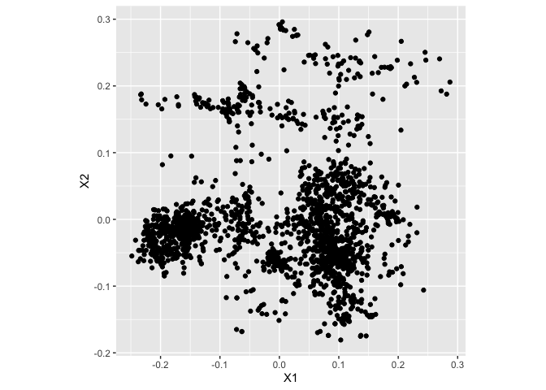
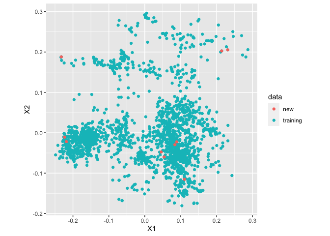

Applying MDS to the Training Data for WhoseEgg Shiny App
================
Katherine Goode <br>
Last Updated: May 07, 2021

**Note: We have not finished implementing this procedure for WhoseEgg,
so it is not currently available in the app.**

This document contains some experimental code that applies
multidimensional scaling (MDS) to the random forest training data used
in WhoseEgg. The results are used to compare the input data points to
the training data points to determine if there are any observations in
the input data that are very different from the training data. If there
observations that differ, then the random forest may have to extrapolate
to make predictions for these observations leading to untrustworthy
predictions.

Note that this method is used as opposed considering each predictor
variable individually, because there is moderate to high correlation
between some of the variables. The correlation between predictor
variables can lead to scenarios where an observation may fall within the
range of the marginal distributions of variables but not within the
range of the joint distributions. Without MDS, observations that fit in
this scenario may be overlooked.

# Setup

Load packages:

``` r
library(dplyr)
library(ggplot2)
library(gower)
library(purrr)
```

Make a vector of the predictor variables:

``` r
vars_pred = c(
  "Month",
  "Julian_Day",
  "Temperature",
  "Conductivity",
  "Larval_Length",
  "Membrane_Ave",
  "Membrane_SD",
  "Membrane_CV",
  "Embryo_to_Membrane_Ratio",
  "Embryo_Ave",
  "Embryo_SD",
  "Embryo_CV",
  "Egg_Stage",
  "Compact_Diffuse",
  "Pigment",
  "Sticky_Debris",
  "Deflated"
)
```

Load the egg data:

``` r
eggdata <- read.csv("../data/eggdata_for_app.csv")
```

Select just the predictor variables and scale the numeric variables:

``` r
eggdata_preds <-
  eggdata %>% 
  select(all_of(vars_pred)) %>%
  mutate_if(.predicate = is.numeric, .funs = scale)
```

# MDS with Gower Distance

We choose to use Gower distance, because it allows for the inclusion of
categorical variables.

``` r
n = dim(eggdata_preds)[1]
n
```

    ## [1] 1972

## MDS on Training Data

Compute the Gower distance between each observation and all other
observations in the data and put in a list (where each element contains
the distances between one observation and all the other observations.)

``` r
list_of_distances <-
  map(
    .x = 1:n,
    .f = function(obs) {
      gower_dist(eggdata_preds, eggdata_preds[obs,])
    }
  )
```

Convert the list of distances to a distance matrix:

``` r
dist_matrix = matrix(unlist(list_of_distances), ncol = n)
```

Apply MDS (specify that the eigenvalues are returned):

``` r
mds <- cmdscale(dist_matrix, eig = TRUE, k = 2)
```

Plot the first two dimensions:

``` r
data.frame(mds$points) %>%
  ggplot(aes(x = X1, y = X2)) + 
  geom_point() + 
  theme(aspect.ratio = 1)
```

<!-- -->

## MDS on Testing Data

Based on discussion
[here](https://stats.stackexchange.com/questions/368331/project-new-point-into-mds-space),
which references [De Silva and Tenenbaum
(2004)](http://graphics.stanford.edu/courses/cs468-05-winter/Papers/Landmarks/Silva_landmarks5.pdf):

-    = number of
    observations
-   
    = matrix of squared distances between all observations
-    = a
    
    matrix of the MDS low dimensional embedding space
-   
    = the transpose of the pseudo-inverse of
    
-   
    = the th column of
    
    containing the squared distances from point
     to all other points
-   
    = mean of the columns of the distance matrix
-    = a new observation
    which we want to put in low dimensional space
-   
    = vector containing the square distance from
     to every other
    training point

Then the projection of the new point
 into the lower
dimensional space is

")

Put a new observation in the low dimensional space of the training data
MDS:

``` r
delta_n = (dist_matrix)^2
L2 = t(mds$points)
L2inv <- t(MASS::ginv(L2))
delta_mu <- colSums(delta_n) / n
a = eggdata_preds[1,]
delta_a = (gower_dist(eggdata_preds, a))^2
xa = -0.5 * L2inv %*% (delta_a - delta_mu)
```

``` r
data.frame(mds$points) %>%
  mutate(data = "training") %>%
  bind_rows(data.frame(t(xa), data = "new")) %>%
  ggplot(aes(x = X1, y = X2, color = data)) + 
  geom_point() + 
  theme(aspect.ratio = 1)
```

<!-- -->

Put a new observation in the low dimensional space of the training data
MDS:

``` r
b = eggdata_preds[1:10,]
n_b = dim(b)[1]
delta_b <-
  map(
    .x = 1:n_b,
    .f = function(obs) {
      gower_dist(eggdata_preds, b[obs,])^2
    }
  ) %>% 
  unlist() %>%
  matrix(ncol = n_b)
xb = -0.5 * L2inv %*% (delta_b - delta_mu)
```

``` r
data.frame(mds$points) %>%
  mutate(data = "training") %>%
  bind_rows(data.frame(t(xb), data = "new")) %>%
  ggplot(aes(x = X1, y = X2, color = data)) + 
  geom_point() + 
  theme(aspect.ratio = 1)
```

<!-- -->
