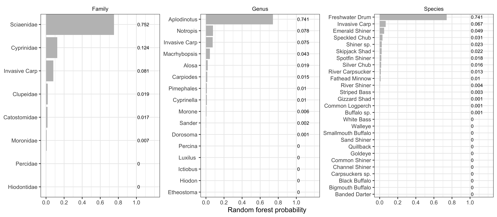

Testing Functions for WhoseEgg Shiny App
================
Katherine Goode <br>
Last Updated: May 07, 2021

This notebook contains the code and example data for testing the
WhoseEgg functions

Load R packages:

``` r
# Load packages
library(dplyr)
library(DT)
library(forcats)
library(ggplot2)
library(markdown)
library(plotly)
library(purrr)
library(randomForest)
library(shiny)
library(shinythemes)
library(stringr)
library(tidyr)
```

Source the helper functions used by the app:

``` r
source("../helper-functions.R")
```

Load the WhoseEgg training data:

``` r
eggdata <- read.csv("../data/eggdata_for_app.csv")
```

Load the WhoseEgg random forest models:

``` r
rfs <- readRDS("../data/rfs_for_app.rds")
```

Select a file for testing the functions:

``` r
input_data <- readxl::read_xlsx("../../example_data/warning_outside_ranges.xlsx")
```

Apply checks to input data to check for any issues:

``` r
check_for_vars(input_data)
## [1] TRUE
get_missing_vars(input_data)
## character(0)
check_fct_levels(input_data)
## [1] TRUE
get_wrong_fct_levels(input_data)
## logical(0)
check_dates(input_data)
## [1] TRUE
get_na_dates(input_data)
## numeric(0)
```

Process the inputs as needed for the random forest:

``` r
processed_inputs <-
  input_data %>%
  compute_variables() %>%
  adjust_variable_types() %>%
  adjust_factor_levels() %>%
  sort_vars()
```

Add a variable if some observations are outside of ranges:

``` r
if (!check_var_ranges(processed_inputs, eggdata)) {
  ids_outside = get_obs_outside_var_ranges(processed_inputs, eggdata)
  processed_inputs <- 
    processed_inputs %>%
    mutate(Warning = ifelse(Egg_ID %in% ids_outside, "var(s) out of range", "none")) %>%
          select(Egg_ID, Warning, everything())
}
processed_inputs %>% select(Egg_ID, Warning) %>% head()
```

    ## # A tibble: 6 x 2
    ##   Egg_ID Warning            
    ##    <dbl> <chr>              
    ## 1      1 none               
    ## 2      2 var(s) out of range
    ## 3      3 none               
    ## 4      4 none               
    ## 5      5 none               
    ## 6      6 none

Prepare the inputs for the random forest:

``` r
inputs_clean <- processed_inputs %>% select(all_of(rf_pred_vars))
```

Get the predictions and random forest probabilities:

``` r
pred_list <-
  list(
    family_pred  = as.character(predict(rfs$Family_IC, inputs_clean)),
    genus_pred   = as.character(predict(rfs$Genus_IC, inputs_clean)),
    species_pred = as.character(predict(rfs$Common_Name_IC, inputs_clean)),
    family_prob  = data.frame(predict(rfs$Family_IC, inputs_clean, type = "prob")),
    genus_prob   = data.frame(predict(rfs$Genus_IC, inputs_clean, type = "prob")),
    species_prob = data.frame(predict(
      rfs$Common_Name_IC, inputs_clean, type = "prob"
    ))
  )
```

Put the predictions in a data frame with the input values:

``` r
data_and_preds <-
  processed_inputs %>%
  mutate(
    Family_Pred = pred_list$family_pred,
    Family_Prob = get_rf_prob(pred_list, "family"),
    Genus_Pred   = pred_list$genus_pred,
    Genus_Prob = get_rf_prob(pred_list, "genus"),
    Species_Pred = pred_list$species_pred,
    Species_Prob = get_rf_prob(pred_list, "species")
  ) %>%
  bind_cols(
    pred_list$family_prob %>% rename_all(
      .funs = function(x)
        paste0("Family_Prob_", x)
    ),
    pred_list$genus_prob %>% rename_all(
      .funs = function(x)
        paste0("Genus_Prob_", x)
    ),
    pred_list$species_prob %>% rename_all(
      .funs = function(x)
        paste0("Species_Prob_", x)
    )
  )
```

Create plots summarizing the random forest predictions:

``` r
rf_pred_plot(data_and_preds)
```

<!-- -->

Create plots with the random forest probabilities for all taxonomic
levels:

``` r
rf_prob_plot(data_and_preds, 1)
```

<!-- -->
