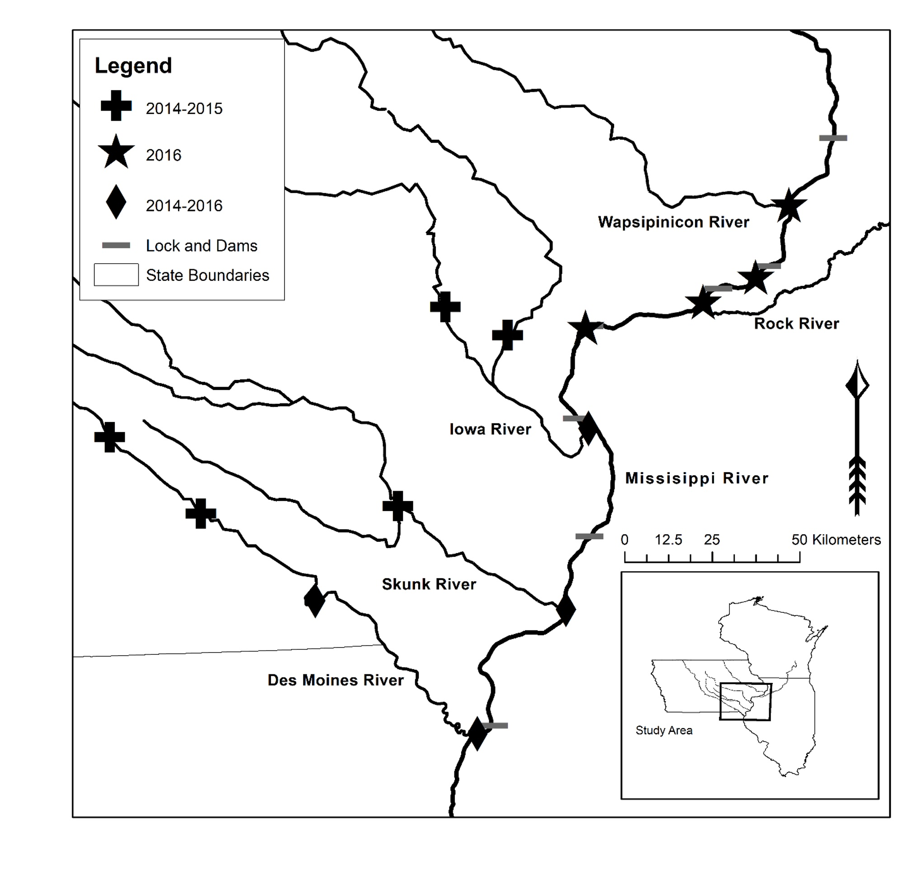

---
output:
  html_document:
    theme: flatly
    toc: true
---

### What if I have data from different locations?

The random forests used by WhoseEgg to make predictions have been validated for eggs collected in the figure below. In particular, the data collected in 2014 and 2015 were used to train the random forests, and the data collected in 2016 were used to validate the models. The models trained using data from 2014 and 2015 showed great performed on the data from 2016 in locations that were sampled in 2014 and/or 2015 but performed worse on locations not previously sampled. However, the sample size of observations at locations sampled only in 2016 was small. See Goode et al. (2021) for more details. These results suggest that the models in WhoseEgg may not perform well on data collected in different geographic regions.

If there is interest in using WhoseEgg to make predictions on data collected in different geographic regions, we recommend the following as possible options:

- Be cautious interpreting the predictions from WhoseEgg if the models are applied to data collected in different geographic regions.

- Compare the predictor variable values to [those used to train](https://github.com/goodekat/WhoseEgg/blob/main/data/eggdata_for_app.csv) the random forests in WhoseEgg. If your predictor variable values differ from the WhoseEgg data (especially values outside the range of the variable values), the models will have to extrapolate to make predictions, which could lead to untrustworthy predictions.

- Perform your own validation of the random forests by applying WhoseEgg to eggs that have been genetically identified. Compare the predictions from WhoseEgg to the genetic identifications to determine if the WhoseEgg predictions are reasonably trustworthy for the new region. 

- If familiar with R, try updating the WhoseEgg models training your own random forests based on the [code](https://github.com/goodekat/WhoseEgg/blob/main/prep/rfs-for-app.md) and [data](https://github.com/goodekat/WhoseEgg/blob/main/data/eggdata_for_app.csv) available at the WhoseEgg [GitHub repository](https://github.com/goodekat/WhoseEgg). Add your data to the [data](https://github.com/goodekat/WhoseEgg/blob/main/data/eggdata_for_app.csv) used to train the models used by WhoseEgg and train new random forest models. 

- If you try validating or updating the WhoseEgg models, the creators of WhoseEgg would be interested to hear about your results. Let us know by emailing whoseegg@iastate.edu.

### What if I believe my data is collected in a region where fish species not included in the training data are present?

Random forests are only able to make predictions for response variable levels included in the training data. See the table below for a list of the family, genus, and species levels included the WhoseEgg training data. If you believe that your data contains a level not present in the training data, we caution the use of WhoseEgg. If you would still like to apply WhoseEgg to your data, we recommend the following as possible options:

- The random forests will classify observations based on predictor variable similarity to those in the training data. Think about whether the different species that may be present in your data are similar to any species in the training data. Check to see if these species appear in the predictions made by WhoseEgg.

- Determine if the species have similar egg characteristics to invasive carp. If they are different from invasive carp, then it may be okay to proceed using WhoseEgg, because the main objective is to identify invasive carp. However, make sure to read through the answer to the previous question about having data from new locations before proceeding.

<table>
 <thead>
  <tr>
   <th style="text-align:left;"> Family </th>
   <th style="text-align:left;"> Genus </th>
   <th style="text-align:left;"> Common Name </th>
   <th style="text-align:center;"> Number of Eggs in Training Data </th>
  </tr>
 </thead>
<tbody>
  <tr>
   <td style="text-align:left;width: 3cm; vertical-align: top !important;" rowspan="7"> Catostomidae </td>
   <td style="text-align:left;width: 3cm; vertical-align: top !important;" rowspan="3"> Carpiodes </td>
   <td style="text-align:left;width: 3cm; "> Carpsuckers sp. </td>
   <td style="text-align:center;width: 3cm; "> 1 </td>
  </tr>
  <tr>
   
   
   <td style="text-align:left;width: 3cm; "> Quillback </td>
   <td style="text-align:center;width: 3cm; "> 1 </td>
  </tr>
  <tr>
   
   
   <td style="text-align:left;width: 3cm; "> River Carpsucker </td>
   <td style="text-align:center;width: 3cm; "> 8 </td>
  </tr>
  <tr>
   
   <td style="text-align:left;width: 3cm; vertical-align: top !important;" rowspan="4"> Ictiobus </td>
   <td style="text-align:left;width: 3cm; "> Bigmouth Buffalo </td>
   <td style="text-align:center;width: 3cm; "> 7 </td>
  </tr>
  <tr>
   
   
   <td style="text-align:left;width: 3cm; "> Black Buffalo </td>
   <td style="text-align:center;width: 3cm; "> 1 </td>
  </tr>
  <tr>
   
   
   <td style="text-align:left;width: 3cm; "> Buffalo sp. </td>
   <td style="text-align:center;width: 3cm; "> 10 </td>
  </tr>
  <tr>
   
   
   <td style="text-align:left;width: 3cm; "> Smallmouth Buffalo </td>
   <td style="text-align:center;width: 3cm; "> 2 </td>
  </tr>
  <tr>
   <td style="text-align:left;width: 3cm; vertical-align: top !important;" rowspan="2"> Clupeidae </td>
   <td style="text-align:left;width: 3cm; "> Alosa </td>
   <td style="text-align:left;width: 3cm; "> Skipjack Shad </td>
   <td style="text-align:center;width: 3cm; "> 1 </td>
  </tr>
  <tr>
   
   <td style="text-align:left;width: 3cm; "> Dorosoma </td>
   <td style="text-align:left;width: 3cm; "> Gizzard Shad </td>
   <td style="text-align:center;width: 3cm; "> 2 </td>
  </tr>
  <tr>
   <td style="text-align:left;width: 3cm; vertical-align: top !important;" rowspan="10"> Cyprinidae </td>
   <td style="text-align:left;width: 3cm; "> Cyprinella </td>
   <td style="text-align:left;width: 3cm; "> Spotfin Shiner </td>
   <td style="text-align:center;width: 3cm; "> 6 </td>
  </tr>
  <tr>
   
   <td style="text-align:left;width: 3cm; "> Luxilus </td>
   <td style="text-align:left;width: 3cm; "> Common Shiner </td>
   <td style="text-align:center;width: 3cm; "> 1 </td>
  </tr>
  <tr>
   
   <td style="text-align:left;width: 3cm; vertical-align: top !important;" rowspan="2"> Macrhybopsis </td>
   <td style="text-align:left;width: 3cm; "> Silver Chub </td>
   <td style="text-align:center;width: 3cm; "> 36 </td>
  </tr>
  <tr>
   
   
   <td style="text-align:left;width: 3cm; "> Speckled Chub </td>
   <td style="text-align:center;width: 3cm; "> 28 </td>
  </tr>
  <tr>
   
   <td style="text-align:left;width: 3cm; vertical-align: top !important;" rowspan="5"> Notropis </td>
   <td style="text-align:left;width: 3cm; "> Channel Shiner </td>
   <td style="text-align:center;width: 3cm; "> 32 </td>
  </tr>
  <tr>
   
   
   <td style="text-align:left;width: 3cm; "> Emerald Shiner </td>
   <td style="text-align:center;width: 3cm; "> 201 </td>
  </tr>
  <tr>
   
   
   <td style="text-align:left;width: 3cm; "> River Shiner </td>
   <td style="text-align:center;width: 3cm; "> 16 </td>
  </tr>
  <tr>
   
   
   <td style="text-align:left;width: 3cm; "> Sand Shiner </td>
   <td style="text-align:center;width: 3cm; "> 1 </td>
  </tr>
  <tr>
   
   
   <td style="text-align:left;width: 3cm; "> Shiner sp. </td>
   <td style="text-align:center;width: 3cm; "> 70 </td>
  </tr>
  <tr>
   
   <td style="text-align:left;width: 3cm; "> Pimephales </td>
   <td style="text-align:left;width: 3cm; "> Fathead Minnow </td>
   <td style="text-align:center;width: 3cm; "> 5 </td>
  </tr>
  <tr>
   <td style="text-align:left;width: 3cm; "> Hiodontidae </td>
   <td style="text-align:left;width: 3cm; "> Hiodon </td>
   <td style="text-align:left;width: 3cm; "> Goldeye </td>
   <td style="text-align:center;width: 3cm; "> 7 </td>
  </tr>
  <tr>
   <td style="text-align:left;width: 3cm; "> Invasive Carp </td>
   <td style="text-align:left;width: 3cm; "> Invasive Carp </td>
   <td style="text-align:left;width: 3cm; "> Invasive Carp </td>
   <td style="text-align:center;width: 3cm; "> 782 </td>
  </tr>
  <tr>
   <td style="text-align:left;width: 3cm; vertical-align: top !important;" rowspan="2"> Moronidae </td>
   <td style="text-align:left;width: 3cm; vertical-align: top !important;" rowspan="2"> Morone </td>
   <td style="text-align:left;width: 3cm; "> Striped Bass </td>
   <td style="text-align:center;width: 3cm; "> 17 </td>
  </tr>
  <tr>
   
   
   <td style="text-align:left;width: 3cm; "> White Bass </td>
   <td style="text-align:center;width: 3cm; "> 1 </td>
  </tr>
  <tr>
   <td style="text-align:left;width: 3cm; vertical-align: top !important;" rowspan="3"> Percidae </td>
   <td style="text-align:left;width: 3cm; "> Etheostoma </td>
   <td style="text-align:left;width: 3cm; "> Banded Darter </td>
   <td style="text-align:center;width: 3cm; "> 1 </td>
  </tr>
  <tr>
   
   <td style="text-align:left;width: 3cm; "> Percina </td>
   <td style="text-align:left;width: 3cm; "> Common Logperch </td>
   <td style="text-align:center;width: 3cm; "> 1 </td>
  </tr>
  <tr>
   
   <td style="text-align:left;width: 3cm; "> Sander </td>
   <td style="text-align:left;width: 3cm; "> Walleye </td>
   <td style="text-align:center;width: 3cm; "> 2 </td>
  </tr>
  <tr>
   <td style="text-align:left;width: 3cm; "> Sciaenidae </td>
   <td style="text-align:left;width: 3cm; "> Aplodinotus </td>
   <td style="text-align:left;width: 3cm; "> Freshwater Drum </td>
   <td style="text-align:center;width: 3cm; "> 738 </td>
  </tr>
</tbody>
</table>

### Will WhoseEgg be updated to contain data from different geographic regions?

The creators of WhoseEgg would like to update the models to contain data from different geographic regions, but there are not plans to do so at this time. If you would like to collaborate by sharing data from different regions or work to update the models yourself, let the creators of WhoseEgg know by emailing whoseegg@iastate.edu.

### What if I am interested in using WhoseEgg to predict fish species other than invasive carp?

The validation of the random forests used by WhoseEgg focused on the classification of invasive carp. If you would like to use WhoseEgg to identify other fish species, please take into account the following considerations: 

- See the table listed under the question 'What if I believe my data is collected in a region where fish species not included in the training data are present?' to determine how many eggs were included in the training data of the fish species of interest. If the number is large, it may be okay to trust the predictions from WhoseEgg. If the number is small, we urge users to be cautious about interpreting the results. 

- Individuals are welcome to use the [random forests](https://github.com/goodekat/WhoseEgg/blob/main/data/rfs_for_app.rds) and [training data](https://github.com/goodekat/WhoseEgg/blob/main/data/eggdata_for_app.csv) available at the WhoseEgg [GitHub repository](https://github.com/goodekat/WhoseEgg) to conduct their own validation of the models focused on other species. 

- If you try validating the WhoseEgg models for other species, the creators of WhoseEgg would be interested to hear about your results. Let us know by emailing whoseegg@iastate.edu.

### Why don’t my extra variables show up in the processed data tab?

While it is okay to upload extra variables to WhoseEgg, these variables will not be used by the random forests to make predictions. As a result, they are excluded from the processed data tab, which only contains the variables that will be used to make predictions. However, these variables will be included in the spreadsheet with predictions available for download. See the preview of the table with data for download on the 'Downloads' page.

### The text in the figures is too small for me to read. What can be done about this?

Try zooming in on the figures using control (Windows) or command (Mac) and the + key (or a similar technique available via your computer).
