---
output:
  html_document:
    theme: flatly
---

#### **Average of Membrane Diameters**

**Definition**:

**Spreadsheet Variable Name**: Membrane_Ave

**Format**:

**Required Upload or Computed After Upload**: Required upload

**Random Forest Predictor Variable**: Yes

**Additional Information**:

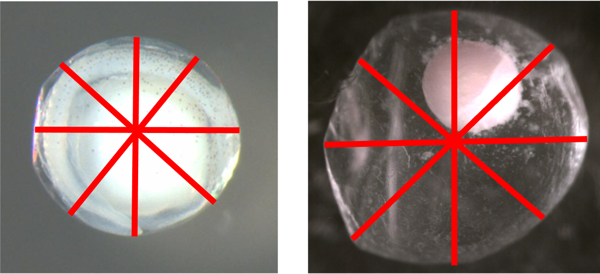

#### **Average of Yolk Diameters**

**Definition**:

**Spreadsheet Variable Name**: Yolk_Ave

**Format**:

**Required Upload or Computed After Upload**: Required upload

**Random Forest Predictor Variable**: Yes

**Additional Information**:

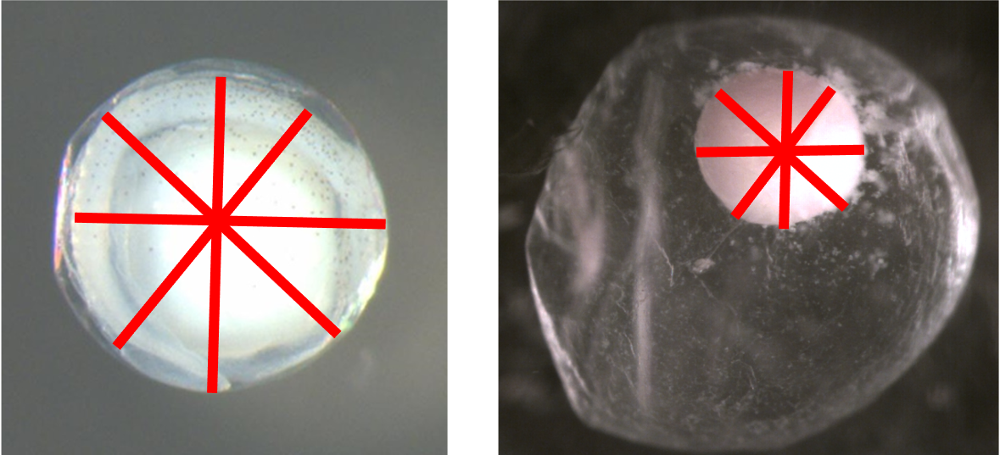

#### **Coefficient of Variation of Membrane Diameters**

**Definition**:

**Spreadsheet Variable Name**: Membrane_CV

**Format**:

**Required Upload or Computed After Upload**: Computed after upload

**Random Forest Predictor Variable**: Yes

**Additional Information**:

#### **Coefficient of Variation of Yolk Diameters**

**Definition**:

**Spreadsheet Variable Name**: Yolk_CV

**Format**:

**Required Upload or Computed After Upload**: Computed after upload

**Random Forest Predictor Variable**: Yes

**Additional Information**:

#### **Compact or Diffuse**

**Definition**: Specifies whether the egg collected is compact or diffuse

**Spreadsheet Variable Name**: Compact_Diffuse

**Format**: Y or N

**Required Upload or Computed After Upload**: Required upload

**Random Forest Predictor Variable**: Yes

**Additional Information**:

Examples of compact eggs: Clearly identifiable yolk entity. The top right picture is tricky when using a picture. When viewed under the microscope the yolk would roll around within the membrane. If you look closely at the right side of the yolk, you can see the space between the yolk and membrane. the yolk is compact but very big. The yolk is nearly as big as the membrane.

Examples of diffuse eggs: The yolk is not in a tightly compact entity within the membrane. The membrane appears to be filled with smoke or the yolk material is scrambled within the membrane.

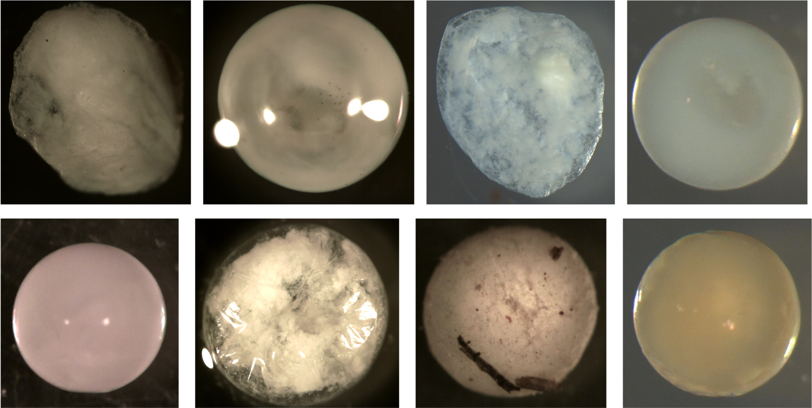

#### **Deflated**

**Definition**: Specifies whether the egg is deflated or not

**Spreadsheet Variable Name**: Deflated

**Format**: Y or N

**Required Upload or Computed After Upload**: Required upload

**Random Forest Predictor Variable**: Yes

**Additional Information**: 

Examples of deflated eggs. All these membranes are not smooth surfaced and spherical. Notice the dents and folds indicating the membrane is smaller now than it was when it was sampled. Some of this may be due to broken membranes from egg handling or desiccation from the ethanol. Most eggs in the training data were not ripped or broken. The membranes appeared intact but shriveled due to water being sucked out by the ethanol during preservation.

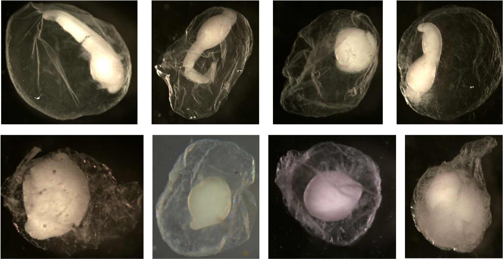

Examples of eggs that are not deflated. Notice all the membranes are spherical and smooth. You do not see folds or dents.

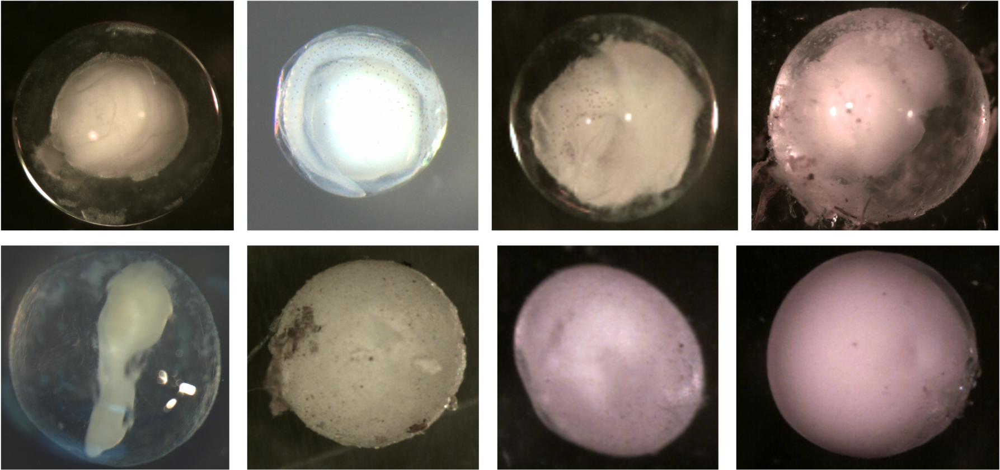

#### **Egg Pigment**

**Definition**: Specifies whether the egg has pigment of not

**Spreadsheet Variable Name**: Pigment

**Format**: Y or N

**Required Upload or Computed After Upload**: Required upload

**Random Forest Predictor Variable**: Yes

**Additional Information**: 

Examples of eggs with pigment. Arrows point at chromatophores (cell containing pigment). Notice in the image in the bottom middle that the larger dark circles are eyes with pigment.

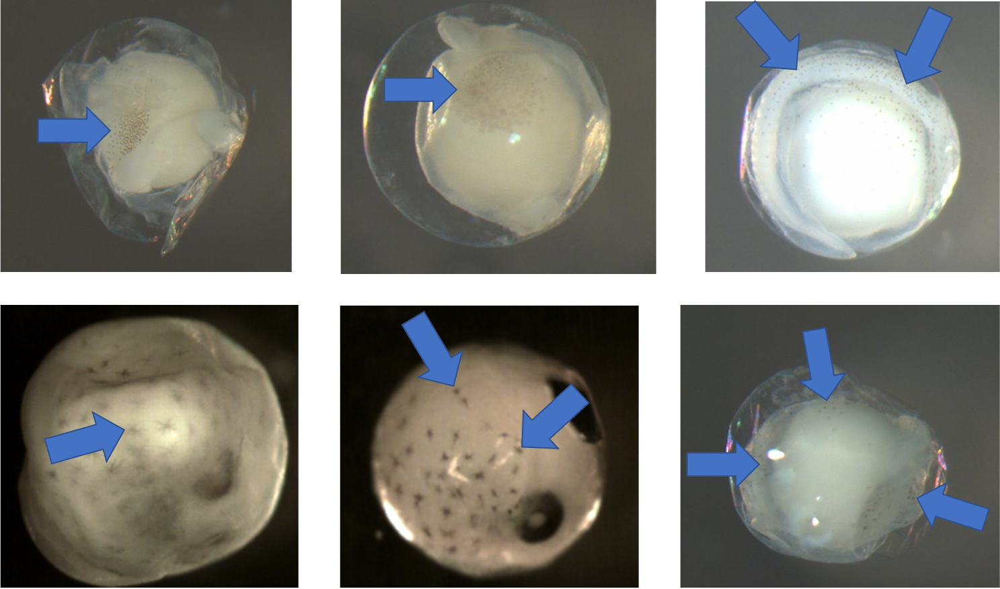

Examples of eggs without pigment. There are no chromatophores present.

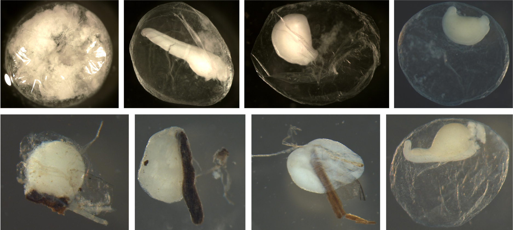

#### **Egg Stage**

**Definition**: Stage of the egg when collected - either 1 through 8, broken, or diffuse

**Spreadsheet Variable Name**: Egg_Stage

**Format**: 1 through 8, BROKEN (if broken), or D (if diffuse)

**Required Upload or Computed After Upload**: Required upload

**Random Forest Predictor Variable**: Yes

**Additional Information**: Below are examples of the stages. Most of these pictures of the stages will not be great representations. Assessing the stage is accomplished best with the egg under the scope so that you can move it around to inspect all sides and angles.

Egg Stage 1 (early cleavage): The blastomeres will look like prongs (typically 4) pointing into one direction. The arrows point to prongs. The top left is the best I have of the 4 prongs. They are not as pronounced but you can still see the cleavage separating each blastomere. The bottom left corner picture shows a side view of 2 prongs. This is difficult to get a picture looking directly into the prongs.

Egg Stage 2 (morula): Arrows point to blastomeres

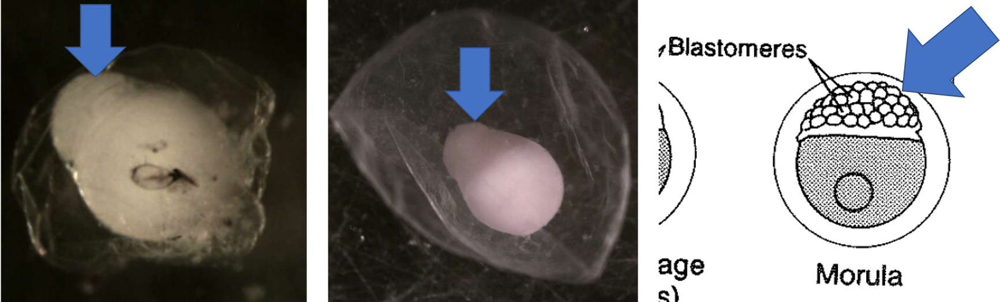

Egg Stage 3 (blastula):

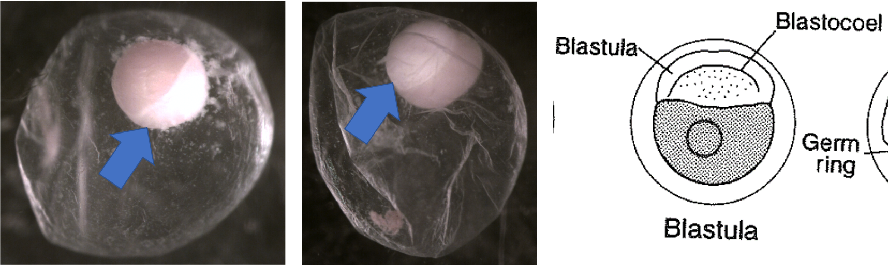

Egg Stage 4 (gastrula): Arrow points to germ ring

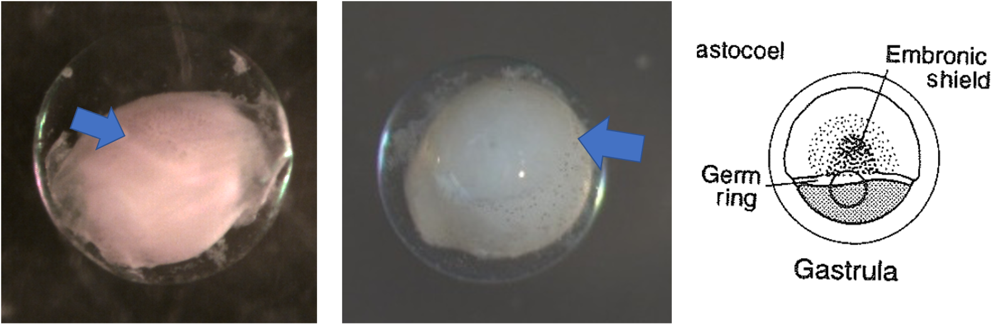

Egg Stage 5 (early embryo): Arrows point to embryonic axis (spine and back forming). This is best described as a ridgeline that sticks out of yolk.

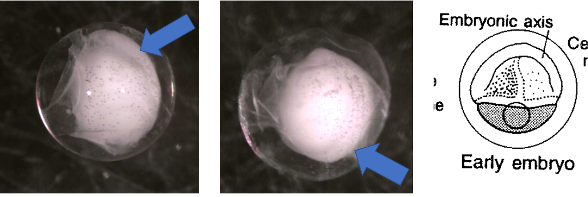

Egg Stage 6 (tail-bud stage): Out of the embryonic axis, the head and tail will form a rounded end. The tail will start to protrude away from yolk.

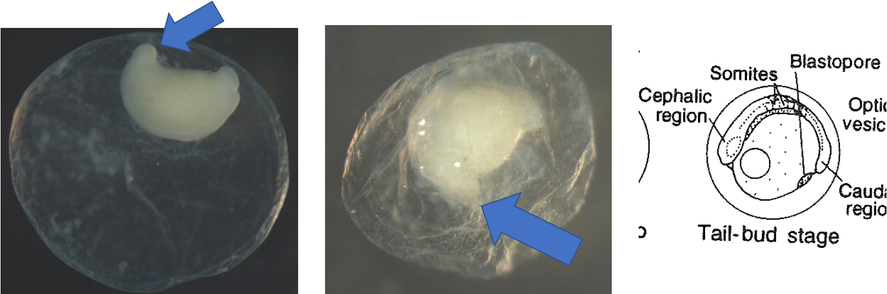

Egg Stage 7 (tail-free stage): Tail continues to protrude away from yolk and is now not touching the yolk arrow points to tail not touching yolk

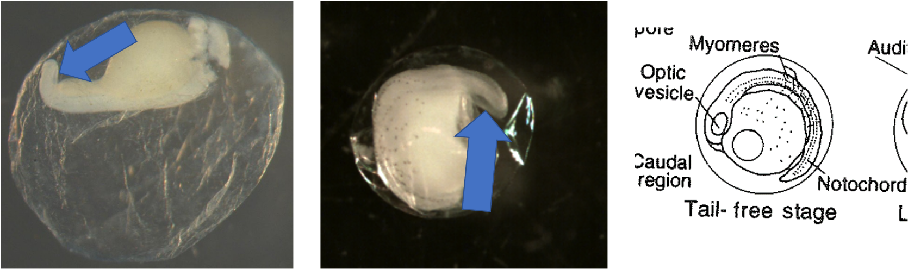

Egg Stage 8 (late embryo): Embryo is almost fully developed. Myomeres, eyes, auditory vesicle are all present. Egg is close to hatching.

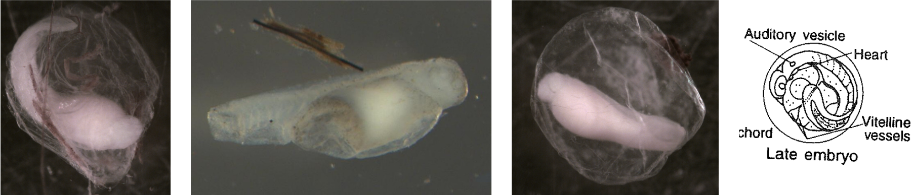

#### **Larval Length**

**Definition**:

**Spreadsheet Variable Name**: Larval_Length

**Format**: 

**Required Upload or Computed After Upload**: Required upload

**Random Forest Predictor Variable**: Yes

**Additional Information**:

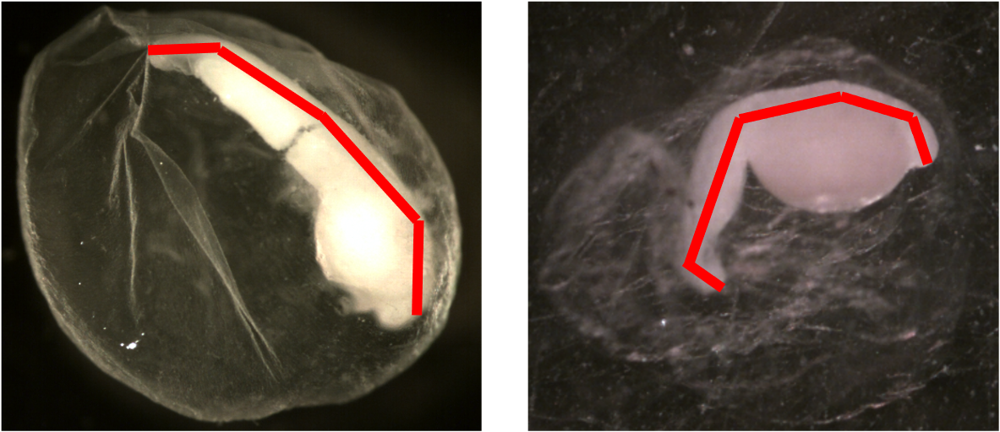

#### **Standard Deviation of Membrane Diameters**

**Definition**:

**Spreadsheet Variable Name**: Membrane_SD

**Format**:

**Required Upload or Computed After Upload**: Required upload

**Random Forest Predictor Variable**: Yes

**Additional Information**:

#### **Standard Deviation of Yolk Diameters**

**Definition**:

**Spreadsheet Variable Name**: Yolk_SD

**Format**:

**Required Upload or Computed After Upload**: Required upload

**Random Forest Predictor Variable**: Yes

**Additional Information**:

#### **Sticky Debris**

**Definition**: Specifies whether there was debris on the egg

**Spreadsheet Variable Name**: Sticky_Debris

**Format**: Y or N

**Required Upload or Computed After Upload**: Required upload

**Random Forest Predictor Variable**: Yes

**Additional Information**: 

Examples of eggs with sticky debris. In all pictures, the debris was adhered to the eggs. Some fish have sticky eggs to keep them from drifting.Most of the debris is wood but the top left shows sand can also stick to eggs.

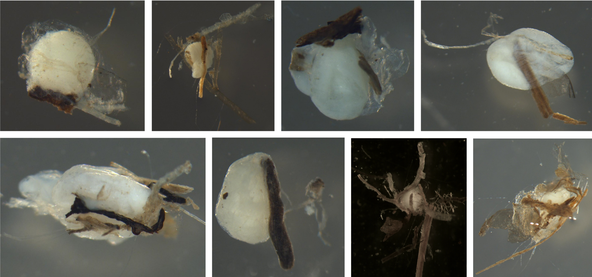

Examples of eggs without sticky debris. There is no debris or sand on the membranes.

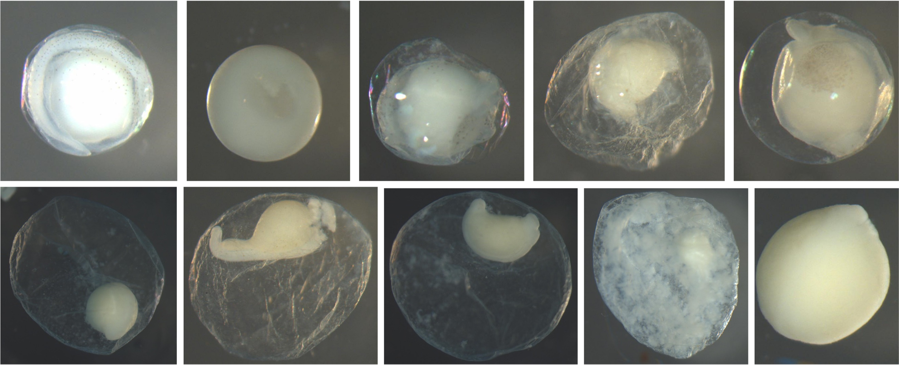

#### **Yolk to Membrane Ratio**

**Definition**: Specifies whether the egg collected is compact or diffuse

**Spreadsheet Variable Name**: Yolk_to_Membrane_Ratio

**Format**:

**Required Upload or Computed After Upload**: Computed after upload

**Random Forest Predictor Variable**: Yes

**Additional Information**:

